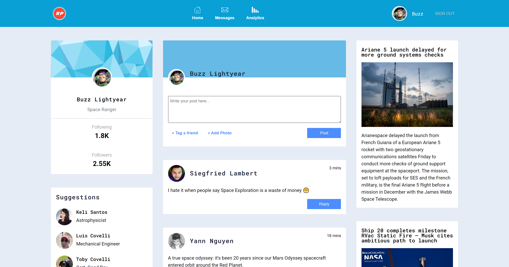

# Red Planet - Social Media Platform

An E-Commerce site that asynchronously populates product categories through processing JSON data. Local storage repopulates the user's cart when revisiting the E-Store. The checkout popup includes form validation.

live: https://thestoreco.web.app/

## Table of contents

- [Overview](#overview)
  - [The challenge](#the-challenge)
  - [Screenshot](#screenshot)
- [My process](#my-process)
  - [Built with](#built-with)
  - [What I learned](#what-i-learned)
  - [Continued development](#continued-development)
  - [API's](#useful-resources)
- [Author](#author)
- [Acknowledgments](#acknowledgments)

## Overview

### The challenge

Initially, I wanted to build a login form that connected with php/mySQL. But because I use Firebase's free hosting for all my work, I found that I would need to use noSQL to be able to access the DB features. It was a bit challenging learning how to get my project connected to the Realtime Database but once it was set up the rest was fairly straight-forward. 

Another challenge I had was trying to find the password associated to the user's email. I needed to take the email input given, find its unique key, and validate if the password associated to the unique key matched. The problem was caching the unique key! I found that the documentation for this issue was hard to follow but eventually I found how to access the key and learned more about transversing around the DB in the process. Once I had the ability to set and retrieve the data, I decided to expand the project and add a homepage. 

### Screenshot

Sign Up:

Login:

Homepage Feed:

## My process

### Built with

- Semantic HTML
- SCSS
- JavaScript
- Firebase's Realtime Database
- Flexbox
- CSS Grid
- Space Flight News API
- Random User API

### What I learned

-How to connect to Firebase's Realtime Database.
-How to set and retrieve data within
-How to access its uniquely generated keys
-How convenient CSS grid is when creating media queries

### Continued development

Commenting Functionality:

For the sake of time, I used the Random User API to generate fake users and append a random comment from a small array of premade space comments that I wrote. Eventually, it would be fun to add commenting features for the logged in user that would be sent to the DB. When user's come to visit the page, they would see posts from other user's who have also visited the page, although, I could see the feed getting cluttered with "asfasdfa" when people attempt to test the code. Moreover, users code potentially reply to other visitors posts.

User Settings:

Add a settings page to allow users to edit their settings such as avatar, career title, or page theme. 

### API's

Random User API:
https://randomuser.me/

Space Flight News API:
https://www.spaceflightnewsapi.net/

## Author

- Website - [Alisar Fares-Boulos](https://www.alisarfaresboulos.com)

## Acknowledgments

I found this video helpful with getting set up with Firebase's Realtime DB.

Getting set up with Firebase Realtime DB:
https://www.youtube.com/watch?v=-UOkri_WNWQ&t=1s
